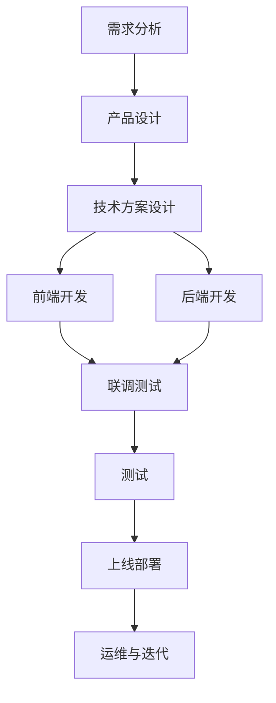

# 欢迎使用Markdown

- TOC
- 高亮代码块
- LaTeX公式
- 表格
- 图片转B64
- 流程图
- 时序图
- 引用
- 复选框
- Tabbed
- Details
- Definition


-------------------

[TOC]

## Markdown简介

> Markdown 是一种轻量级标记语言，它允许人们使用易读易写的纯文本格式编写文档，然后转换成格式丰富的HTML页面。 —— [维基百科](https://zh.wikipedia.org/wiki/Markdown)

## 主要功能

### 1. 代码块

```python
@requires_authorization
def somefunc(param1='', param2=0):
    '''A docstring'''
    if param1 > param2: # interesting
        print 'Greater'
    return (param2 - param1 + 1) or None
  
class SomeClass:
    pass


if __name__ == '__main__':
    print 'hello world'
```

```bash
echo "Hello world!"
```

### 2. LaTeX 公式

可以创建行内公式，例如 $\Gamma(n) = (n-1)!\quad\forall n\in\mathbb N$。

或者块级公式：
$$	x = \dfrac{-b \pm \sqrt{b^2 - 4ac}}{2a} $$

### 3. 表格
| Item      |    Value | Qty  |
| :-------- | --------:| :--: |
| Computer  | 1600 USD |  5   |
| Phone     |   12 USD |  12  |
| Pipe      |    1 USD | 234  |

### 4. 流程图


### 5. 复选框

使用 `- [ ]` 和 `- [x]` 语法可以创建复选框，实现 todo-list 等功能。例如：

- [x] 已完成事项
- [ ] 待办事项1
- [ ] 待办事项2


### 6. 图片


### 7. Blocks

#### Definition

/// define
Apple

- Pomaceous fruit of plants of the genus Malus in
  the family Rosaceae.

///

#### Details

/// details | Some summary
Some content
///

#### Emoji

:smile: :heart: :thumbsup:


```bash
echo "Hello, world!"
```


#### Tabbed

/// tab | Tab A title
Tab A content
///

/// tab | Tab B title
Tab B content
///
